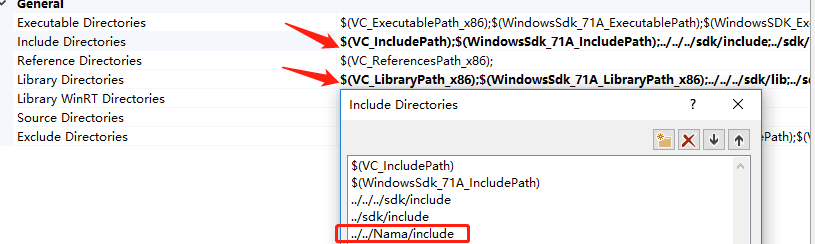

此程序fork自声网接入demo：https://github.com/AgoraIO/OpenLive-Windows

在声网demo的基础上进行的极简的修改，演示了如何快速接入Faceunity的SDK：https://github.com/Faceunity/FULivePC/tree/dev

具体改动内容如下(共三处修改即可极简接入)：

1.增加NamaSDK的 include和Lib Direction

2.在authpack.h中放置相芯科技的证书文件，在AgoraObject.h中24行处

`#define APP_ID				_T("")`

设置声网注册到的AppID。

3.DeviceDlg.cpp中8-18行进行include，77-211行进行声网回调函数声明与相芯NamaSDK的初始化，218-222进行回调函数注册。

4.F5运行即可看到声网SDK接入相芯NamaSDK后开启美颜后的效果。如需切换相芯其他道具效果只需将DeviceDlg.cpp中147行

`static const std::string g_faceBeautification = "face_beautification.bundle";`

替换为

`static const std::string g_faceBeautification = "baimao_Animoji.bundle";`

再次运行即可看到相芯的Avatar Animoji的效果。

**以下为声网demo原说明文档：**

# Open Live Windows

这个开源示例项目演示了如何快速集成Agora视频SDK，实现多人视频连麦直播。

在这个示例项目中包含了以下功能：

- 加入通话和离开通话；
- 主播和观众模式切换；
- 静音和解除静音；
- 切换摄像头；
- 选择分辨率、码率和帧率；

本开源项目使用 **C++** 语言

你也可以在这里查看入门版的示例项目：[Agora-Windows-Tutorial-1to1](https://github.com/AgoraIO/Agora-Windows-Tutorial-1to1)

Agora视频SDK支持 iOS / Android / Windows / macOS 等多个平台，你可以查看对应各平台的示例项目：

- [OpenLive-Android](https://github.com/AgoraIO/OpenLive-Android)
- [OpenLive-iOS](https://github.com/AgoraIO/OpenLive-iOS)
- [OpenLive-macOS](https://github.com/AgoraIO/OpenLive-macOS)

## 运行示例程序
首先在 [Agora.io 注册](https://dashboard.agora.io/cn/signup/) 注册账号，并创建自己的测试项目，获取到 App ID。将 APP_ID宏定义内容改为刚才申请的 App ID

```
#define APP_ID _T("Your App ID")
```

然后在 [Agora.io SDK](https://www.agora.io/cn/download/) 下载 **视频通话 + 直播 SDK**，解压后将其中的 **sdk** 复制到本项目目录下（并覆盖原有旧目录）。

最后使用 VC++2013 打开 OpenLive.sln，编译整个解决方案即可运行

Note:
  本开源项目在 debug 模式下运行可能会出现崩溃，请在 release 模式下运行。

## 运行环境
* VC++ 2013(或更高版本)
* Windows 7(或更高版本)

## 联系我们

- 完整的 API 文档见 [文档中心](https://docs.agora.io/cn/)
- 如果在集成中遇到问题，你可以到 [开发者社区](https://dev.agora.io/cn/) 提问
- 如果有售前咨询问题，可以拨打 400 632 6626，或加入官方Q群 12742516 提问
- 如果需要售后技术支持，你可以在 [Agora Dashboard](https://dashboard.agora.io) 提交工单
- 如果发现了示例代码的bug，欢迎提交 [issue](https://github.com/AgoraIO/OpenLive-Windows/issues)

## 代码许可

The MIT License (MIT).